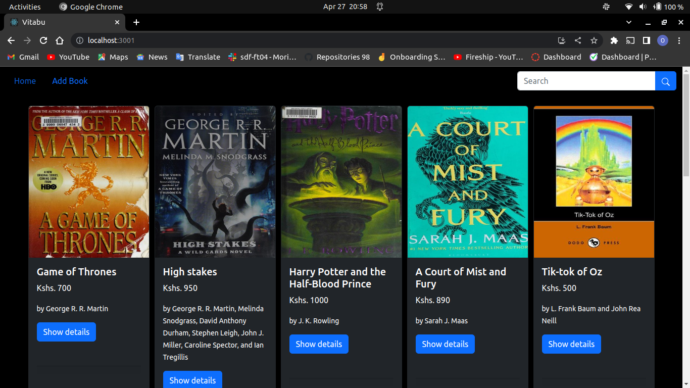
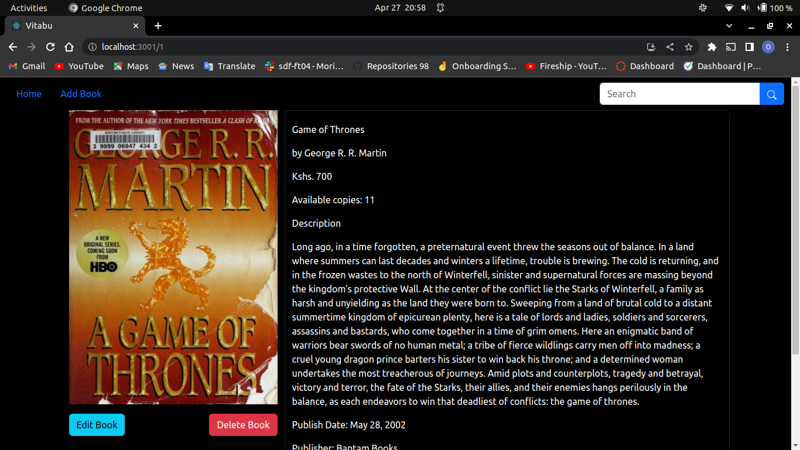
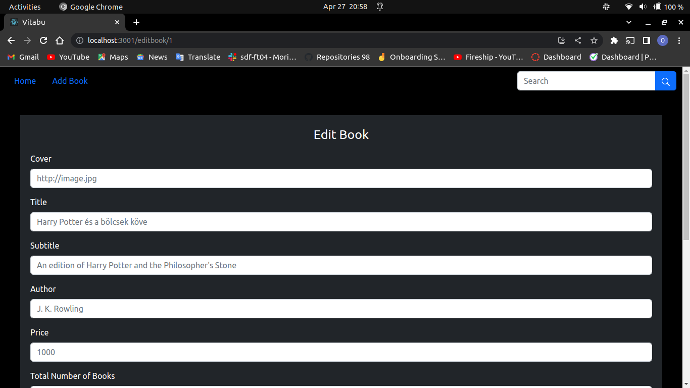

# Kitabu #
Kitabu is a web application that shows the user a collection of books. The user can view a list of their favorite books along with information about them, such the author, summary, price, and publisher, to mention a few. Also, the user can add their own book to the app and view it listed with all the other books. Also, the user has the option to update their own book by adding or deleting any elements they see fit. Also, if a person doesn't want to see the book, they can delete it. The user may also search for their preferred book by its title, such as Harry Potter.

# Demo #
The pictures as shown depict the outlook of the web app
## Home Page ##

## Details Page ##

## Add Book ##

## Edit Book ##

# Getting Started #
To run this application:

* Clone from [here](https://github.com/Ngaremaina/Kitabu)
* Run this command: npm install
* Run this command: npm start

# Technologies
The technologies used to host the website are [Netlify](https://kitabu.netlify.app/) for the front end and [Render](https://book-data.onrender.com/books) for the backend

# To view the published website #
To visit this website, click on the link [here](https://kitabu.netlify.app/).

# Author #
Ngare Maina

# License #
MIT License

